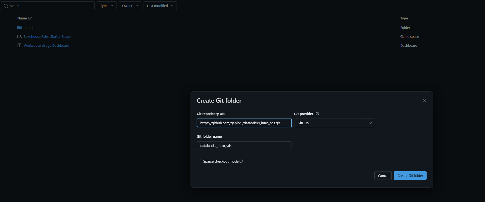
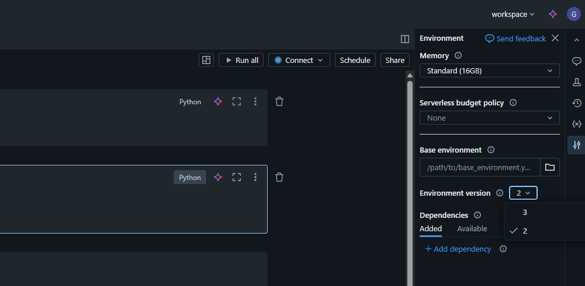

# databricks_intro_sds
Introduction to Databrick for ML on Superdatascience plaftorm.

Databricks Free Edition:
https://docs.databricks.com/aws/en/getting-started/free-edition

Install Databricks CLI Windows:
winget search databricks
winget install Databricks.DatabricksCLI

databricks -v

Install uv Windows Powershell:
powershell -ExecutionPolicy ByPass -c "irm https://astral.sh/uv/install.ps1 | iex" 

Activate environment:
uv venv -p 3.11 .venv
source .venv/Scripts/activate

Add this to your ~/.bashrc or run it manually for now:
export PATH="/c/Users/your_user/AppData/Roaming/Python/Scripts:$PATH"

Connect to Databricks host:
databricks auth login --host https://dbc-xxxxx-xxxx.cloud.databricks.com/

pyproject.toml contains all the required dependencies
To install dependencies:
uv sync --extra dev

To uninstall certain package, for example:
uv pip uninstall databricks-connect

Databricks-Connect comes with PySpark embeeded into it.

Create repo folder inside Databricks Workspace

Install and run build
uv pip install build
python -m build

Databricks Serverless environment versions:
https://docs.databricks.com/aws/en/release-notes/serverless/environment-version/

By default the whl created after the build is not uploaded to the repository. But if you move the whl to other folder and sync the repo you can use the whl inside databricks UI:
%pip install insurance-0.1.0-py3-none-any.whl instead of %pip install -e ..
